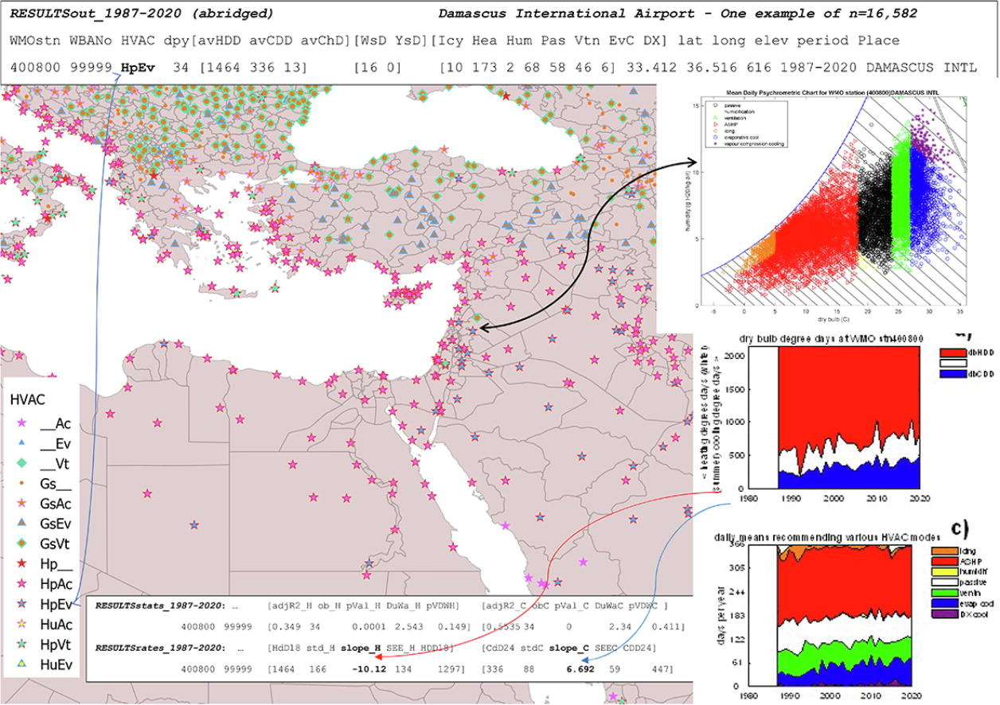

# predilection

a predisposition, preference, or bias

18th century: from French prédilection, from Latin praedilect- ‘preferred’, from the verb praediligere, from prae ‘in advance’ + diligere ‘to select’.

---------------------------------------

## Global and local bioclimatic predilections for rebalancing the heating and cooling of buildings
### Eric Laurentius Peterson
Visiting Research Fellow, University of Leeds, Leeds, United Kingdom
Climatic Information Technical Committee TC4.2, American Society of Heating, Refrigeration, and Air-conditioning Engineers, Atlanta, GA, USA
Received 1 February 2022, Revised 22 March 2022, Accepted 7 April 2022, Available online 9 April 2022, Version of Record 29 April 2022.
Energy and Buildings Volume 266, 1 July 2022, 112088

[DOI 10.1016/j.enbuild.2022.112088](https://doi.org/10.1016/j.enbuild.2022.112088)

Corresponding author <e.peterson@leeds.ac.uk>

#### Graphical Abstract

| code | Description | code | Description |
| ---- | ----------- | ---- | ----------- |
| __Ac | cooling only air-conditioning | GsAc | combustion heater AND air-conditioning (or reverse-cycle ground-source)|
| __Ev | direct evaporative cooling | GsEv | combustion heater AND direct evaporative cooler |
| __Vt | forced ventilation | GsVt | combustion heater AND forced ventilation cooling |
| ____ | entirely passive comfort would be sufficient | Gs__ | ground-source or combustion heating |
| Hp__ | air-source heat pump (ASHP) | Hu__ | humidification only |
| HpVt | ASHP AND forced ventilation cooling | HuVt | humidifier AND forced ventilation cooling |
| HpEv | ASHP AND direct evaporative cooler | HuEv | humidifier AND direct evaporative cooler |
| HpAc | reverse-cyle air-source year-round | HuAc | humidifier AND air-conditioner |

You may find access to a version of “RESULTSout_1987-2020.csv” with a psychrometric chart of the places you are interested in >[right here](https://bioclimatic.github.io/predilection/RESULTSout_1987-2020_psych.htm)<.  There are n=15,293 psychrometric charts, while locations without humidity observations could not be plotted, yielding a 404 error.  

#### Disclaimer
The information or advise contained in this website is intended for use only by persons who have had adequate technical training in the field of heating, ventilation, and air conditioning (HVAC) system design. This website has been compiled as an aid only and the information or advice should be verified before it is put to use by any person. The user should also establish the applicability of the information or advice in relation to any specific circumstances. While the information or advise is believed to be correct, the author Eric Laurentius Peterson, and his employer The University of Leeds, disclaim responsibility for any inaccuracies contained within the document including those due to any negligence in the preparation and publication of this website. Those using this website are advised that it was developed as a repository of supporting on-line material in relation to the paper published in the peer-reviewed journal Energy and Buildings. Users of this website are asked to read the paper, [DOI 10.1016/j.enbuild.2022.112088](https://doi.org/10.1016/j.enbuild.2022.112088).  Please email if you have difficulties <e.peterson@leeds.ac.uk> or concerns.

#### Highlights

• Access to air-conditioned shelter was often indispensable between 20°S and 39°N and below 500 m.

• Reverse-cycle air-source heat-pump/air-conditioning was reasonable for 72% of the population.

• Stationary heating and cooling demands were found where 19% of population dwelt.

• Summer cooling demand generally increased while winter heating demand decreased.

• Heating and cooling demands both increased in some mid-latitude continental areas.

• Over 30% of population dwelt where heating demand increased.

• While almost 65% dwelt where cooling demand increased.

#### Abstract
Air-conditioning relies on electricity that isn’t ubiquitous while policies encourage passive alternatives —yet cooling really should respond to occupants’ distress. Here I show where passive measures have been sufficient for comfort and identify local predilections for rebalancing demand between heating and cooling —apportioned by population neighboring meteorological stations. Access to air-conditioned shelter has been occasionally indispensable for 21% of population —generally between 20°S and 39°N and below 500 m elevation. Meanwhile reverse-cycle air-source heat-pump/air-conditioning has been a reasonable expectation for 72% of the population. Refocusing on 9493 locations with ≥ 14 years of daily observations, stationary heating and cooling demands were found where 19% of population dwelt. Otherwise, summer cooling demand generally increased while winter heating demand decreased —except some mid-latitude continental areas demonstrated a predilection for both heating and cooling demands to increase. Over 30% of population dwelt where heating demand increased, while almost 65% dwelt where cooling demand increased. To estimate which HVAC package is locally appropriate, refer to nearby comparable meteorological stations detailed in the file “RESULTSout_1987-2020.csv” (n = 16,582 records) that can be downloaded at [University of Leeds](https://doi.org/10.5518/967) but beware of microclimatic variability in urban heat islands.

##### Abbreviations

| abv | explanation |
| --- | --- |
| YsD | Yellow-flag or worse outdoor stress days (average per annum) based on daily maximum wetbulb globe temperature in shade ≥ 29.4°C |
| WsD | White-flag or worse outdoor stress days (average per annum) based on daily maximum wetbulb globe temperature in shade ≥ 25.6°C |
| DXD | Average days per annum that direct expansion air-conditioning is desirable based upon mean daily outdoor conditions |

##### link

check this link >[right here](https://bioclimatic.github.io/predilection/CCs/RESULTSout_1987-2020_psych_AA.htm)<
